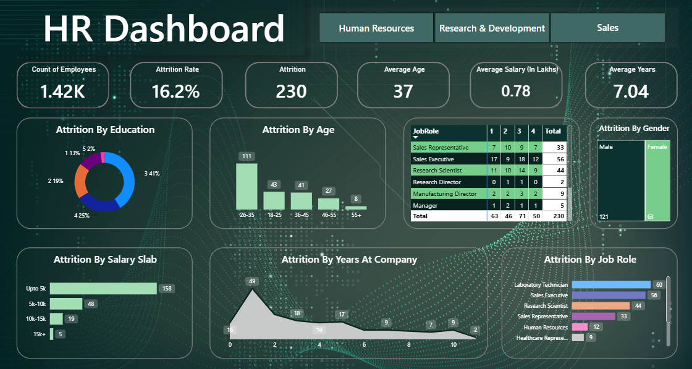

# 📊 HR Analytics Dashboard | Power BI

An interactive **HR Analytics Dashboard** built using **Microsoft Power BI** to analyze employee attrition, workforce demographics, and key HR metrics. The dashboard helps identify trends and supports data-driven HR decision-making.

## 📁 Dataset Information

- Total Records: 1,481
- Total Features (Columns): 38

## 🚀 Features

- Employee Count
- Attrition Count & Rate
- Average Age, Salary & Years at Company
- Attrition Analysis by:
  - Age
  - Gender
  - Education
  - Job Role
  - Salary Slab
  - Years at Company

The dashboard includes KPIs for employee count, attrition rate, average age, average salary, and average years at the company, along with visual analyses across education, age, salary, job roles, and gender.

## 🛠️ Tools Used

- Microsoft Power BI
  - Power Query
  - DAX
  - Data Modeling

## 📂 Dashboard Preview

